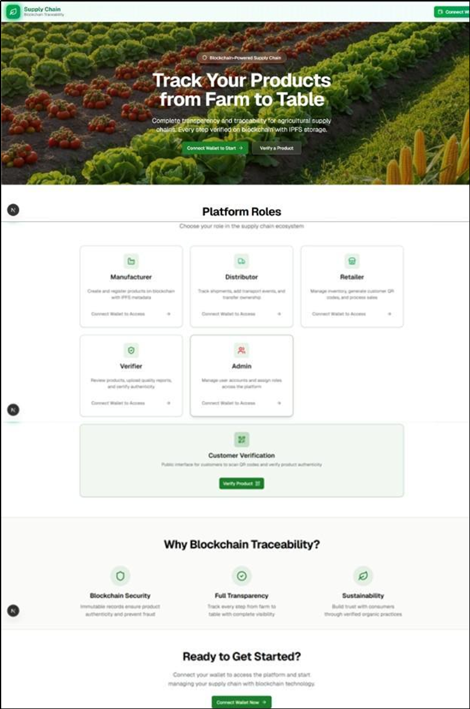
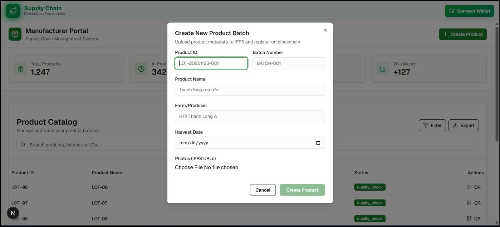
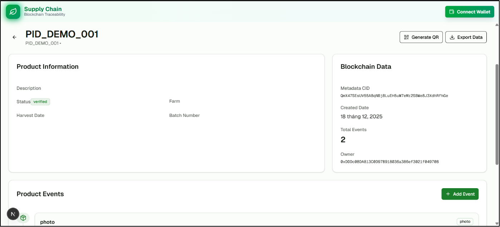
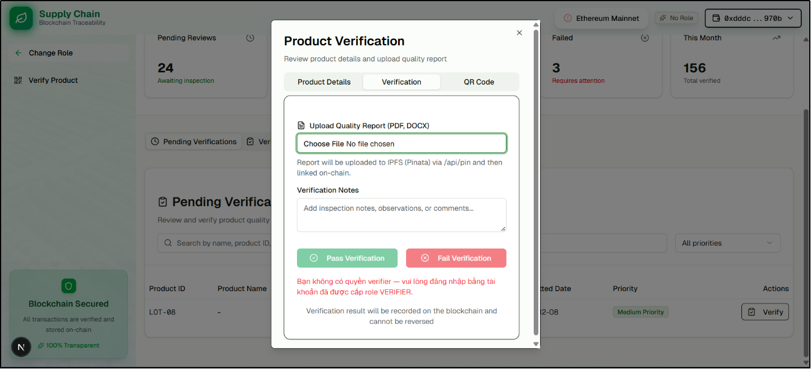
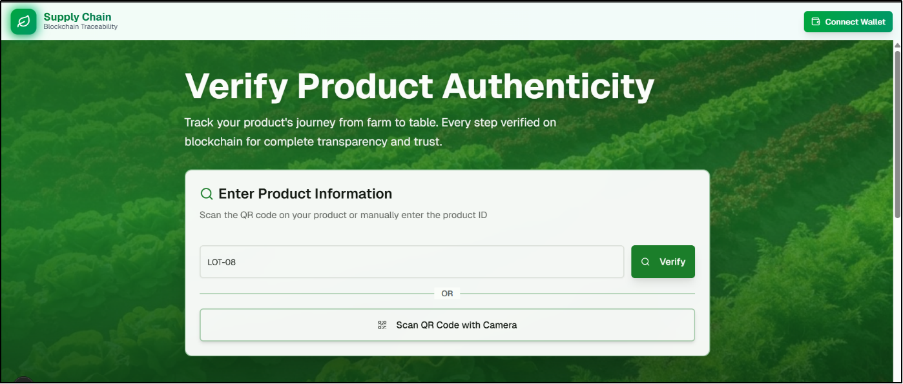

# 🌱 Trace System – Blockchain-based Product Traceability

## 📌 Overview
Trace System is a blockchain-based application for tracking and verifying product origin in the agricultural supply chain.  
The system uses **Ethereum**, **IPFS (Pinata)**, and **smart contracts** to ensure data transparency and integrity.

---

## 🎥 Demo

👉 Watch demo video here:  
🔗 https://drive.google.com/file/d/1uV53NSyoGS87i2wcUjahQ1l05ro4I4wo/view?usp=sharing

*Demo includes: product creation, event tracking, verification, and traceability workflow.*

## 🖥️ User Interface

### 🏠 Homepage

### 📦 Product Management

### 📊 Product Details & Events

### ✅ Quality Verification

### 🔍 Product Traceability

## 🎯 Objectives
- Ensure **data transparency and traceability**
- Store data securely using **blockchain + IPFS**
- Support **verification process** with immutable records

---

## 🏗️ Architecture
- **Blockchain (Ethereum):**
  - Product registration
  - Event tracking
  - Verification status
- **IPFS (Pinata):**
  - Store images, reports, metadata

👉 Hybrid approach helps reduce storage cost while maintaining data integrity  

---

## ⚙️ Core Features
- **Product Registration:** create product with metadata stored on IPFS  
- **Event Tracking:** record lifecycle events (production, transport, etc.)  
- **Verification:** upload reports and update verification status  
- **Traceability:** users can check product history  

---

## 👥 Roles
- **Admin:** manage system roles  
- **Manufacturer:** create and manage products  
- **Verifier:** verify product quality  
- **Customer:** view product information  

---

## 🔄 Workflow
1. Upload product data → IPFS  
2. Store CID on blockchain  
3. Add tracking events  
4. Verify product  
5. User retrieves product history  

---

## 🌐 Technologies
- Next.js (Frontend)
- Ethereum + MetaMask
- IPFS (Pinata)
- Smart Contracts

---
